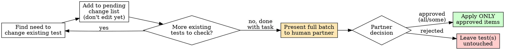

# TDD Test Change Approval

## Overview

New tests are the point of TDD — write them freely. But a change to an **existing, already-passing test** is different: it can silently delete the record of a behavior someone relied on. Existing tests don't get modified or removed on the agent's own authority. They get modified or removed on the human partner's authority, after the agent explains why.

**Core principle:** One batched decision beats a hundred small ones. Collect every existing-test change for the whole task, present them together with reasons, get one explicit go-ahead, then execute exactly that list — nothing more.

## Scope: what requires approval

Requires approval (this is an EXISTING test):
- Changing an assertion's expected value or condition
- Weakening or removing an assertion
- Renaming a test in a way that changes what it claims to verify
- Deleting a test
- Skipping/disabling a test (`.skip`, `xit`, commenting out)
- Changing test setup/fixtures in a way that changes what the test exercises

Does NOT require approval (proceed normally under TDD):
- Adding a brand-new test
- Adding a new assertion to a test you are writing in this same task, before it has ever run green
- Refactoring test code with zero behavioral change (e.g., extracting a shared helper) — but only if you can point to the before/after and show the assertions are byte-for-byte equivalent in meaning. If there is any doubt, treat it as a change requiring approval.

## Workflow



### 1. Never edit an existing test on discovery

The moment you notice an existing test needs to change, do not touch it. Add it to a running **pending changes list** for this task instead, and keep working. This is what makes batching possible — if you edit as you go, you can't present one clean batch later.

Record for each entry:
- File path and test name
- Current behavior it asserts
- What you want to change and to what
- **Why** — the specific production change that makes the old assertion wrong (name it, don't hand-wave)
- Modify vs. delete vs. skip

### 2. Batch the request

Once you've finished the pass that surfaces these (end of implementation, or end of task — whichever comes first and makes sense to stop at), present the **entire list at once**, not one question per test. Use a single AskUserQuestion (or, if the count or nuance doesn't fit that tool's shape, a single clearly formatted message) covering all pending entries together. Never send a second follow-up test-change question later in the same task without a new discovery.

Format each entry as: test name → reason → what changes. Group by file if it helps scanning. Make the reasoning the headline, not the diff — the human partner is deciding whether the reason is legitimate, not proofreading syntax.

### 3. Wait for one decision covering the batch

Accept partial approval ("yes to 1 and 3, no to 2") — apply only what was approved, leave the rest untouched, and say so plainly afterward.

### 4. Apply only what was approved — hard guard

- Track the approved set explicitly (e.g., a short checklist) before touching any file.
- Before editing a test file, confirm the specific test you're about to change is in the approved set. If it isn't, stop — do not edit it, do not "while I'm in here" adjust a neighboring assertion.
- If, while applying approved changes, you discover you also need to touch a test that wasn't in the batch, that's a NEW discovery — stop, do not make the edit, and go back to step 2 with just that new item (don't silently fold it in).
- After applying, diff what changed against the approved list. Anything outside it is a bug in your own process — revert it.

## Red Flags — STOP

- "I'll just fix this test too while I'm here" — not in the approved list, so no.
- Editing a test file before the batch was approved.
- Asking about test changes one at a time as you encounter them.
- Silently deleting a test because it "doesn't make sense anymore" without listing it in the batch first.
- Treating a rename that changes meaning as a "refactor" to skip approval.
- Bundling unrelated new-test additions into the same approval ask — new tests don't need approval, don't pad the batch with them.

## Example batch message

```
Existing tests need changes before I continue — none touched yet:

1. auth.test.ts › "rejects empty password"
   Reason: password minimum length changed from 0 to 8 (ticket-driven), so
   empty-password rejection is now covered by the new min-length test.
   Change: delete (superseded by "rejects passwords under 8 chars")

2. auth.test.ts › "login returns token"
   Reason: token shape changed from string to {token, expiresAt} per the
   new session work.
   Change: modify assertion to check result.token instead of result

3. checkout.test.ts › "applies discount before tax"
   Reason: none — flagging that I do NOT think this needs to change,
   just confirming since it touches the same function.
   Change: none proposed, listed for visibility only

Reply with which to approve (e.g. "1 and 2, not 3").
```
