# Test-Driven Development

## Overview

Write the test first. Watch it fail. Write the minimal code that passes.

**Core principle:** if you didn't watch the test fail, you don't know whether it tests anything.

**Second principle, equally load-bearing:** a test's job is to *find a defect*, not to pass. A suite written to demonstrate the code works gets written — subconsciously, every time — to succeed, and then finds nothing. Every test you write should be aimed at a specific way the code could be wrong.

**Violating the letter of the rules is violating the spirit of the rules.**

## When to Use

**Always:** new features, bug fixes, refactoring, behavior changes.

**Exceptions (ask your human partner first):** throwaway prototypes, generated code.

Thinking "skip TDD just this once"? That's the rationalization. See the table at the bottom.

## The Iron Law

```
NO PRODUCTION CODE WITHOUT A FAILING TEST FIRST
```

Wrote code before the test? Delete it. Start over.

**No exceptions:**
- Don't keep it as "reference"
- Don't "adapt" it while writing the test
- Don't look at it
- Delete means delete

Implement fresh from the test.

## Red-Green-Refactor

```dot
digraph tdd_cycle {
    rankdir=LR;
    pick [label="PICK\nnext behavior", shape=box, style=filled, fillcolor="#ffe9c9"];
    red [label="RED\nwrite failing test", shape=box, style=filled, fillcolor="#ffcccc"];
    verify_red [label="Fails for the\nright reason?", shape=diamond];
    green [label="GREEN\nminimal code", shape=box, style=filled, fillcolor="#ccffcc"];
    verify_green [label="Passes?\nAll green?", shape=diamond];
    refactor [label="REFACTOR\nclean up", shape=box, style=filled, fillcolor="#ccccff"];
    mutate [label="Mutation check:\nanything unprotected?", shape=diamond];
    done [label="Hand off to\nend-to-end-testing", shape=ellipse];

    pick -> red;
    red -> verify_red;
    verify_red -> green [label="yes"];
    verify_red -> red [label="wrong failure"];
    green -> verify_green;
    verify_green -> green [label="no"];
    verify_green -> refactor [label="yes"];
    refactor -> mutate;
    mutate -> pick [label="gap found"];
    mutate -> done [label="clean"];
}
```



### PICK — Choose the Next Test

The cycle tells you *how* to write a test. It does not tell you *which* one, and a rigorous cycle applied to badly-chosen cases produces a suite that is complete by ritual and thin by content.

Choose in this order — each yields cases the others miss:

1. **Boundary values.** The highest-payoff technique there is. For every range, count, or limit: test on the edge, just inside, and just outside. Valid range 1–999 → test `1`, `999`, `0`, `1000`. Analyze **output** boundaries too, not just input ones — the edges of the input domain and the edges of the result range are frequently different circumstances.
2. **Equivalence classes.** One representative per valid class, and **each invalid class in its own test, alone** — one rejection masks another, leaving the second validation untested while appearing covered.
3. **Error guessing.** Enumerate what the implementer plausibly forgot. The reliable seed is `0`, empty, and one.

Details and checklists: `references/choosing-the-next-test.md`.

**Two requirements that are not optional, not "edge cases if time permits":**

- **Invalid and unexpected inputs get tests, not just valid ones.** They have a *higher* defect yield than valid inputs. Most defects that reach production are reached by a route nobody imagined.
- **Assert what must NOT happen.** Checking that the code does what it should is half the job; the other half is checking it doesn't do what it must not. A payroll function that returns correct paychecks is still broken if it also writes checks for nonexistent employees, and no positive assertion will ever catch that. Every test that causes a side effect should assert the side effects that must be absent.

### RED — Write the Failing Test

Before writing the body, answer: **what production change would make this test fail, and is that change a bug or a decision?** If the only thing that can fail it is an intentional decision — a constant's value, exact message wording, private structure — it's a change detector: it fires on redesign and sleeps through bugs.

**Derive the expected value by hand.** A `want` computed by the code under test, or by its helpers, passes no matter what that code does.

```typescript
// ❌ Mirror assertion — the same builder computes both sides
expect(buildQuery({ tag: 'urgent' })).toBe(buildQuery({ tag: 'urgent' }));

// ✅ Hand-derived literal
expect(buildQuery({ tag: 'urgent' })).toBe('tag:"urgent"');
```

<Good>
```typescript
test('retries a failing operation 3 times, then succeeds', async () => {
  let attempts = 0;
  const operation = () => {
    attempts++;
    if (attempts < 3) throw new Error('fail');
    return 'success';
  };

  const result = await retryOperation(operation);

  expect(result).toBe('success');
  expect(attempts).toBe(3);
});
```
Names the behavior, exercises real code, asserts one thing.
</Good>

<Bad>
```typescript
test('retry works', async () => {
  const mock = jest.fn()
    .mockRejectedValueOnce(new Error())
    .mockResolvedValueOnce('success');
  await retryOperation(mock);
  expect(mock).toHaveBeenCalledTimes(2);
});
```
Vague name, and the assertion is about the mock rather than the code.
</Bad>

### Verify RED — Watch It Fail

**MANDATORY. Never skip.**

Confirm all three:
- It **fails**, rather than erroring out
- The failure message is the one you expected
- It fails because the behavior is missing — not because of a typo, bad import, or broken fixture

**Passes already?** You're testing existing behavior. The test is wrong, or the feature exists.

### GREEN — Minimal Code

Simplest thing that passes. No extra options, no speculative parameters, no refactoring of neighboring code.

### Verify GREEN — Watch It Pass

**MANDATORY.** Confirm the test passes, every other test still passes, and the output is pristine — no errors, no warnings, no unexpected logging.

**Test fails?** Fix the code, not the test. Changing an existing test's assertions to match new behavior requires the `tdd-test-change-approval` skill first.

### REFACTOR — Clean Up

Only once green. Remove duplication, improve names, extract helpers. Add no behavior. Stay green.

### Mutation Check — The Real Stopping Rule

**"All tests pass" is not a completion criterion.** It's satisfiable by writing weak tests, and holding it as the goal steers you — subconsciously, reliably — toward cases that cannot fail. Green is the price of entry, not the finish line.

Before calling the behavior done, mentally mutate the production code. **At least one test must fail for each realistic mutation:**

- Wrong constant, wrong argument, off-by-one
- Inverted condition or wrong branch taken
- A state change or side effect removed
- Returns empty, zero, or the default
- Validation removed for zero, empty, null, unauthorized, or malformed input

A mutation nothing catches means either that behavior is unprotected or the test is tautological. Both are work remaining.

**Then apply the clustering rule:** the probability of more defects in a section is proportional to the number already found there. Defects come in clusters. When one function yields three bugs, your next hour belongs there — not spread evenly across the module.

## Good Tests

| Quality | Good | Bad |
|---|---|---|
| **Names the break** | You can state the bug it catches | Exists for coverage |
| **Minimal** | One behavior. "and" in the name? Split it. | `validates email and domain and casing` |
| **Independent expectation** | Hand-derived literal or fixture | Computed by the code under test |
| **Real code** | Exercises the actual component | Asserts on a mock's behavior |
| **Behavioral** | Runs the thing, checks the outcome | Greps source text for a line |

**On mocks:** mock the slow or external thing, and keep everything the test depends on real. Learn a method's side effects before replacing it — a mock that swallows a write which later code reads produces a green test and a broken integration. Mirror real data structures completely, including fields your test doesn't read. Never assert on the mock itself: that assertion passes when the mock is present and fails when it's absent, which tells you nothing about your code. When mock setup outgrows the test logic, that's the signal to use the real components instead.

**Test your code, not the framework.** Assert the contract at your boundary — the query you emit, the payload you produce, the route you register. Upstream mechanics belong to their maintainers' test suites.

## Unit Green Is Not Done

A *perfect* unit test suite still cannot find the most expensive class of defect. Unit tests ask "does this module match its interface spec?" They structurally cannot ask "did we build the right thing?" — errors made translating objectives into a specification are invisible to every test derived from that specification.

When the unit cycle is complete for a user-facing feature, flow, endpoint, or integration point, **hand off to the `end-to-end-testing` skill.** Reporting "all tests pass" while no test has exercised the assembled system is an overstatement of what you verified.

## Bugs

Never fix a bug without a test. Reproduce it with a failing test first, then follow the cycle — the test proves the fix and prevents the regression.

Then, per the clustering rule, don't stop at the one test. The bug tells you where defect density is high. Write the neighbouring cases too: the boundary either side of it, the invalid input adjacent to it, the side effect it should not have had.

## Rationalizations

| Excuse | Reality |
|---|---|
| "I'll write tests after to verify it works" | Tests written after pass immediately, and passing immediately proves nothing. You never saw it catch anything. |
| "Tests after achieve the same goal — it's spirit not ritual" | Tests-after ask "what does this do?" Tests-first ask "what should this do?" The first is biased by your implementation; you test what you built, not what was required. |
| "I already manually tested the edge cases" | Manual testing leaves no record, can't re-run, and is re-invented worse after every change. "It worked when I tried it" is not coverage. |
| "Deleting hours of work is wasteful" | Sunk cost. The time is gone either way. The waste is keeping code you can't trust. |
| "It's too simple to break" | Simple code breaks constantly. The test costs 30 seconds. |
| "All the tests pass, so I'm done" | That's the entry condition, not the exit. Run the mutation check. |
| "TDD is dogmatic; pragmatic means adapting" | TDD *is* the pragmatic option: bugs caught before commit, regressions caught immediately, refactoring made safe. The shortcut ends in production debugging. |
| "The happy path works, edge cases can wait" | Invalid and unexpected inputs have the higher defect yield. You're skipping the productive half. |

## Red Flags — Stop and Start Over

- Production code exists with no failing test that preceded it
- You never actually watched the test fail
- The expected value came from running the code and copying the output
- You're editing an existing test's assertions to make a failure go away
- You're about to report "done" and cannot name a mutation your suite would catch
- "This is different because…"

## When Stuck

| Problem | Solution |
|---|---|
| Don't know how to test it | Write the API you wish existed. Write the assertion first. |
| Don't know which test to write next | Boundary values, then invalid classes, then error guessing. |
| Test is too complicated | The design is too complicated. Simplify the interface. |
| Must mock everything | Too coupled. Inject dependencies. |
| Setup is enormous | Extract helpers; if it's still huge, the design is the problem. |
| Suite is green but you don't trust it | Mutation check. It will tell you exactly what's unprotected. |
